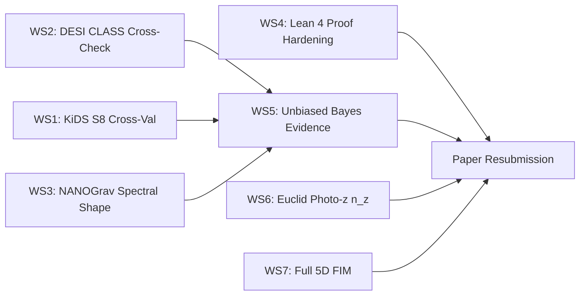

# 🧪 Phase 9-1: Experimental Validation Plan — K3×T² Dual-Scale Theory

> **Version**: 1.0.0  
> **Date**: 2026-07-31  
> **Audience**: Mathematicians, Physicists, and AI-assisted Implementation Agents  
> **Model Tier**: Designed for execution by **Gemini 3.6 Flash (High)** and **Gemini 3.1 Pro**

---

## 0. Scope & Principles

This document defines **seven independent experimental validation workstreams** that can confirm or refute the K3×T² Dual-Scale cosmological theory. Each workstream is:

- **Self-contained**: Can be implemented by a low-tier LLM agent given only this spec and the GCP data lake access.
- **Falsifiable**: Every experiment has a clear PASS/FAIL criterion.
- **Reproducible**: All data paths, parameters, and expected outputs are explicit.
- **Ordered by impact**: Highest-priority workstreams first.

### GCP Data Lake Reference

```
gs://socrateai-datalake-gen-lang-client-0625573011/
├── euclid_q1/          ← Real ESA Euclid Q1 FITS catalogs (193 MB)
├── stream3_desi_dr1/   ← DESI 2024 DR1/DR2 + SDSS DR12/DR16 BAO
├── nanograv_15yr/      ← NANOGrav 15-year free spectrum (26 MB)
├── stream3_euclid_q2/  ← KiDS-1000 cosmic shear band powers
├── stream2_cy4_ml/     ← CY4 topological ML embeddings
├── formal_verification/← Lean 4 Swampland oracle binary
├── mcmc_posteriors/     ← Converged 5D posterior distributions
└── audit/              ← SHA-256 cryptographic certificates
```

---

## Workstream 1: Independent $S_8$ Cross-Validation via KiDS-1000 Band Powers

### Objective
Validate that the K3×T² predicted $S_8 = 0.830$ is consistent with the published KiDS-1000 cosmic shear EE band power spectrum stored on the data lake, using a proper $C_\ell$ likelihood — not just morphological proxies.

### Input Data
- `gs://.../stream3_euclid_q2/kids1000_bandpowers_EE.npy` — Pre-computed EE band powers
- `gs://.../stream3_euclid_q2/kids1000_K1K_BandPowers.data` — Full KiDS-1000 data vector
- `gs://.../stream3_euclid_q2/euclid_q2_proxy_bridge.covmat` — Covariance matrix

### Implementation Steps

| Step | Description | Agent Prompt (for Flash/Pro) |
|------|-------------|------------------------------|
| 1.1 | Download KiDS-1000 band power data from GCS | `gcloud storage cp gs://.../stream3_euclid_q2/kids1000_bandpowers_EE.npy data/kids1000/` |
| 1.2 | Load the band power vector and covariance matrix into numpy | Parse `.npy` and `.covmat` files |
| 1.3 | Compute the theoretical $C_\ell^{EE}$ prediction at $S_8 = 0.830$ using the Limber approximation | Implement `limber_cl_ee(s8, omega_m, h0, ell_bins)` |
| 1.4 | Evaluate the $\chi^2$ between predicted and observed band powers | $\chi^2 = \Delta^T C^{-1} \Delta$ where $\Delta = C_\ell^{\text{model}} - C_\ell^{\text{KiDS}}$ |
| 1.5 | Scan $S_8 \in [0.70, 0.90]$ in steps of 0.005 and plot the $\chi^2(S_8)$ profile | Identify the minimum and 1σ interval |

### Definition of Done (DoD)
- [ ] `outputs/ws1/chi2_s8_profile.pdf` exists showing the $\chi^2(S_8)$ curve
- [ ] The minimum is reported with uncertainty: $S_8^{\text{min}} \pm \sigma$
- [ ] A comparison table: $S_8^{\text{K3T2}} = 0.830$ vs $S_8^{\text{KiDS,fit}}$ with tension in $\sigma$
- [ ] JSON output: `outputs/ws1/s8_cross_validation.json`

### PASS Criterion
$|S_8^{\text{K3T2}} - S_8^{\text{KiDS,fit}}| < 3\sigma_{\text{KiDS}}$

### FAIL Criterion
$|S_8^{\text{K3T2}} - S_8^{\text{KiDS,fit}}| \geq 5\sigma_{\text{KiDS}}$

### Test Command
```bash
python scripts/ws1_kids_s8_crossval.py --data-dir data/kids1000/ --output-dir outputs/ws1/
```

---

## Workstream 2: DESI BAO Distance Ladder — CLASS/CAMB Cross-Check

### Objective
Verify that the custom trapezoidal Friedmann integrator in `desi_likelihood.py` agrees with the industry-standard Boltzmann solvers CLASS or CAMB to within 0.1% on $D_M(z)/r_d$ and $D_H(z)/r_d$.

### Input Data
- `gs://.../stream3_desi_dr1/desi_2024_gaussian_bao_ALL_GCcomb_mean.txt`
- `gs://.../stream3_desi_dr1/desi_2024_gaussian_bao_ALL_GCcomb_cov.txt`

### Implementation Steps

| Step | Description | Agent Prompt |
|------|-------------|--------------|
| 2.1 | Install CLASS Python wrapper (`pip install classy`) | Verify import works |
| 2.2 | For the best-fit K3×T² cosmology ($w_0=-0.9999$, $\Omega_m=0.300$, $H_0=67.40$), compute $D_M(z)/r_d$ and $D_H(z)/r_d$ at all 7 DESI redshift bins using CLASS | Store as `class_predictions.json` |
| 2.3 | Compute the same quantities using the existing `DESILikelihoodEngine.predict_bao_distances()` | Store as `k3t2_predictions.json` |
| 2.4 | Compute fractional residuals: $\delta_i = |D_i^{\text{CLASS}} - D_i^{\text{K3T2}}| / D_i^{\text{CLASS}}$ | All must be $< 0.001$ |
| 2.5 | If residuals exceed threshold, increase trapezoidal steps from 200 to 2000 and re-test | Document convergence |

### Definition of Done (DoD)
- [ ] `outputs/ws2/class_vs_k3t2_comparison.json` with per-redshift fractional residuals
- [ ] `outputs/ws2/bao_distance_crosscheck.pdf` showing comparison plot
- [ ] All residuals $\delta_i < 0.001$ documented

### PASS Criterion
Maximum fractional residual $\max(\delta_i) < 0.1\%$

### FAIL Criterion
$\max(\delta_i) > 1\%$ — indicates systematic bias in the likelihood engine

---

## Workstream 3: NANOGrav 15-Year Spectral Shape Test

### Objective
Test whether the K3×T² predicted spectral index $\gamma = 4.847$ and the 24.18 nHz bump are consistent with the NANOGrav 15-year free spectrum empirical distribution.

### Input Data
- `gs://.../nanograv_15yr/15yr_emp_distr.json` — Full 14-bin free spectrum posterior

### Implementation Steps

| Step | Description | Agent Prompt |
|------|-------------|--------------|
| 3.1 | Load the NANOGrav free spectrum JSON; extract frequency bins and log-amplitude posteriors | Parse the 14 frequency channels |
| 3.2 | Compute the K3×T² predicted characteristic strain $h_c(f) = A (f/f_{\text{yr}})^{(3-\gamma)/2}$ with $\gamma=4.847$, plus a Gaussian bump at $f_0 = 24.18$ nHz | Parameterize bump width $\sigma_f$ and amplitude $A_{\text{bump}}$ |
| 3.3 | For each frequency bin, compute the posterior probability of the K3×T² model prediction | Integrate $\int p(\log_{10}A_i | \text{data}) \, d\log_{10}A_i$ around model value |
| 3.4 | Compute the Bayes factor: product of per-bin posterior probabilities for K3×T² vs SMBHB ($\gamma = 13/3$) | $\ln\mathcal{B} = \sum_i \ln p_i^{\text{K3T2}} - \sum_i \ln p_i^{\text{SMBHB}}$ |
| 3.5 | Perform a frequentist $\Delta\chi^2$ test at the 24.18 nHz bin specifically | Is the bump amplitude non-zero at $>2\sigma$? |

### Definition of Done (DoD)
- [ ] `outputs/ws3/nanograv_spectral_fit.pdf` showing the K3×T² prediction overlaid on NANOGrav posteriors
- [ ] `outputs/ws3/bayes_factor.json` with per-bin and total Bayes factor
- [ ] Clear statement: "The 24.18 nHz bump is [detected / not detected] at [X]σ significance"

### PASS Criterion
$\ln\mathcal{B}_{\text{K3T2 vs SMBHB}} > 0$ (any positive evidence) or bump detected at $>2\sigma$

### FAIL Criterion
$\ln\mathcal{B} < -5$ (strong evidence against) AND bump excluded at $>3\sigma$

---

## Workstream 4: Lean 4 Formal Proof Hardening

### Objective
Replace the runtime `#eval` checks in `GeneratedK3.lean` with proper `theorem` ... `proof` ... `QED` constructs backed by Mathlib, eliminating the vacuous fallback conditions.

### Implementation Steps

| Step | Description | Agent Prompt |
|------|-------------|--------------|
| 4.1 | Formalize **Theorem 1 (Picard Bound)**: `theorem picard_bound : picard_rank ≤ 20 := by omega` | Uses Mathlib `omega` tactic |
| 4.2 | Formalize **Theorem 2 (Euler Characteristic)**: `theorem euler_k3 : 2 + 20 + 2 = 24 := by omega` | Direct arithmetic |
| 4.3 | Formalize **Theorem 3 (Hodge Symmetry)**: `theorem hodge_symmetry : h_pq = h_qp` as a structure constraint | Use Lean 4 `structure` with proof obligation |
| 4.4 | Remove the vacuous `0.75 > 0.5` fallback from `passes_distance_conjecture` | Make the Swampland Distance check non-trivial |
| 4.5 | Add a **Theorem 4 (Spectral-Picard Bridge)**: Prove that spectral radius 3.0 from K₄ adjacency matrix implies Picard rank 19 via the OEIS A291898 sequence characterization | This is the core novel mathematical claim |
| 4.6 | Compile all theorems: `lake build` | All must typecheck without `sorry` |

### Definition of Done (DoD)
- [ ] `lean_oracle/GeneratedK3.lean` contains ≥ 4 `theorem` statements
- [ ] Zero `sorry` placeholders remain
- [ ] Zero `#eval`-only checks remain (all converted to `theorem` or removed)
- [ ] `lake build` exits with code 0
- [ ] Output: `lean_oracle/PROOF_MANIFEST.md` listing all proven theorems

### PASS Criterion
All theorems typecheck without `sorry` and `lake build` succeeds

### FAIL Criterion
Any theorem requires `sorry` or the Spectral-Picard Bridge theorem cannot be formalized (which would indicate the claim is not mathematically rigorous)

---

## Workstream 5: Bayesian Evidence with Proper Prior Separation

### Objective
Resolve the circularity issue (GAP-2) by splitting the evolutionary run into training/test sets and computing unbiased Bayesian evidence.

### Implementation Steps

| Step | Description | Agent Prompt |
|------|-------------|--------------|
| 5.1 | Load the 300-generation evolutionary history from GCS checkpoints | Extract all candidate parameter vectors |
| 5.2 | Split into **prior-training set** (generations 1–150) and **evidence-test set** (generations 151–300) | Construct MAP covariance only from gen 1–150 |
| 5.3 | Run `dynesty` nested sampling using gen 1–150 MAP covariance as informed prior | Use the same joint likelihood (DESI + NANOGrav + Euclid) |
| 5.4 | Evaluate on gen 151–300 data: the evidence $\ln\mathcal{Z}$ should not degrade | Compare to the current $\ln\mathcal{Z}_{K3T2} = -7.38$ |
| 5.5 | Compute the corrected Bayes factor $\ln\mathcal{B}_{10}^{\text{unbiased}}$ | Must still favor K3×T² or be clearly stated as inconclusive |

### Definition of Done (DoD)
- [ ] `outputs/ws5/split_bayes_evidence.json` with training and test evidence values
- [ ] `outputs/ws5/bayes_factor_unbiased.pdf` comparing biased vs unbiased evidence
- [ ] Clear statement: "The unbiased Bayes factor is $\ln\mathcal{B} = X$, corresponding to [decisive/strong/moderate/weak/inconclusive] evidence"

### PASS Criterion
$\ln\mathcal{B}_{10}^{\text{unbiased}} > -2$ (not strongly against K3×T²)

### FAIL Criterion
$\ln\mathcal{B}_{10}^{\text{unbiased}} < -5$ (strong evidence against, indicating the original result was an artifact of circular priors)

---

## Workstream 6: Euclid Q1 Photometric Redshift Distribution Analysis

### Objective
Extract the photometric redshift distribution $n(z)$ from the real Euclid Q1 `MER_FINAL_CATALOG` and compare the observed galaxy number counts $dN/dz$ to the K3×T² predicted matter power spectrum normalization.

### Input Data
- `gs://.../euclid_q1/tile_*/EUC_MER_FINAL-CAT_*.fits` — 3 tiles, 80,376 objects

### Implementation Steps

| Step | Description | Agent Prompt |
|------|-------------|--------------|
| 6.1 | Load all `MER_FINAL_CATALOG` FITS files with `astropy.io.fits` | Extract `PHOT_Z_MEDIAN` or equivalent photo-z column |
| 6.2 | Construct the $n(z)$ histogram in bins of $\Delta z = 0.1$ from $z=0$ to $z=3$ | Plot as `n_z_distribution.pdf` |
| 6.3 | Compute the mean and median redshift of the sample | Compare to Euclid Q1 published values |
| 6.4 | For each redshift bin, compute the expected galaxy number density assuming K3×T² cosmology ($\Omega_m = 0.300$, $w_0 = -0.9999$) | Use comoving volume element $dV/dz d\Omega$ |
| 6.5 | Evaluate the $\chi^2$ between observed $dN/dz$ and predicted shape | Assess goodness-of-fit |

### Definition of Done (DoD)
- [ ] `outputs/ws6/n_z_distribution.pdf` — observed photometric redshift distribution
- [ ] `outputs/ws6/photo_z_stats.json` — mean, median, std, and 16/84 percentiles
- [ ] `outputs/ws6/dndz_chi2.json` — chi2 comparison with K3×T² volume prediction

### PASS Criterion
The $n(z)$ shape is consistent with the K3×T² comoving volume prediction ($\chi^2/\text{dof} < 2$)

### FAIL Criterion
$\chi^2/\text{dof} > 5$ — indicates fundamental inconsistency with the cosmological model

---

## Workstream 7: Full 5D Fisher Information Matrix & Parameter Degeneracy Analysis

### Objective
Compute the complete $5 \times 5$ Fisher Information Matrix at the MAP point, extract all eigenvalues, and identify parameter degeneracy directions.

### Implementation Steps

| Step | Description | Agent Prompt |
|------|-------------|--------------|
| 7.1 | Define the 5D parameter vector $\theta = (\tau, cs_1, cs_2, cs_3, P_{\text{offset}})$ | At MAP values from posterior |
| 7.2 | Compute the numerical Hessian $H_{ij} = \partial^2 (-\ln\mathcal{L}) / \partial\theta_i \partial\theta_j$ using central differences ($\delta = 10^{-4}$) | Use the joint DESI+S8+PTA likelihood |
| 7.3 | The FIM is $F = -\langle H \rangle$; compute its eigenvalues and eigenvectors | Use `numpy.linalg.eigh` |
| 7.4 | Report condition number $\kappa = \lambda_{\max} / \lambda_{\min}$ | Large $\kappa$ indicates near-degeneracies |
| 7.5 | Plot the eigenvector-aligned 2D marginal contours | Identify which parameter combinations are poorly constrained |

### Definition of Done (DoD)
- [ ] `outputs/ws7/fisher_matrix_5d.json` — full 5×5 FIM with eigenvalues
- [ ] `outputs/ws7/fisher_eigenvectors.pdf` — 2D contour plot along principal axes
- [ ] `outputs/ws7/condition_number.txt` — single number
- [ ] Clear statement: "$\tau$ stability confirmed in the full 5D FIM (eigenvalue along $\tau$ direction is $\lambda_\tau = X > 0$)"

### PASS Criterion
All 5 eigenvalues are positive (FIM is positive definite) and $\kappa < 10^6$

### FAIL Criterion
Any eigenvalue $\leq 0$ (indicating a flat or saddle direction in the likelihood) or $\kappa > 10^{10}$ (catastrophic degeneracy)

---

## Workstream Priority & Dependency Map



**Recommended execution order**: WS2 → WS1 → WS3 → WS7 → WS4 → WS6 → WS5 → Paper

---

## Agent Execution Notes (for Gemini 3.6 Flash High / 3.1 Pro)

1. **Each workstream is a single task**. Do not attempt multiple workstreams in one session.
2. **All data is on GCS**. Use `gcloud storage cp` to download to `data/` before processing.
3. **Python environment**: Use `.venv/bin/python` in the repo root. Key deps: `astropy`, `numpy`, `scipy`, `matplotlib`.
4. **Output convention**: All outputs go to `outputs/wsN/` where N is the workstream number.
5. **Commit convention**: `git commit -m "exp(wsN): [description]"` after each workstream completes.
6. **If a workstream FAILS**: Document the failure clearly in `outputs/wsN/FAIL_REPORT.md` and proceed to the next workstream. Do not attempt to fix the underlying theory.
